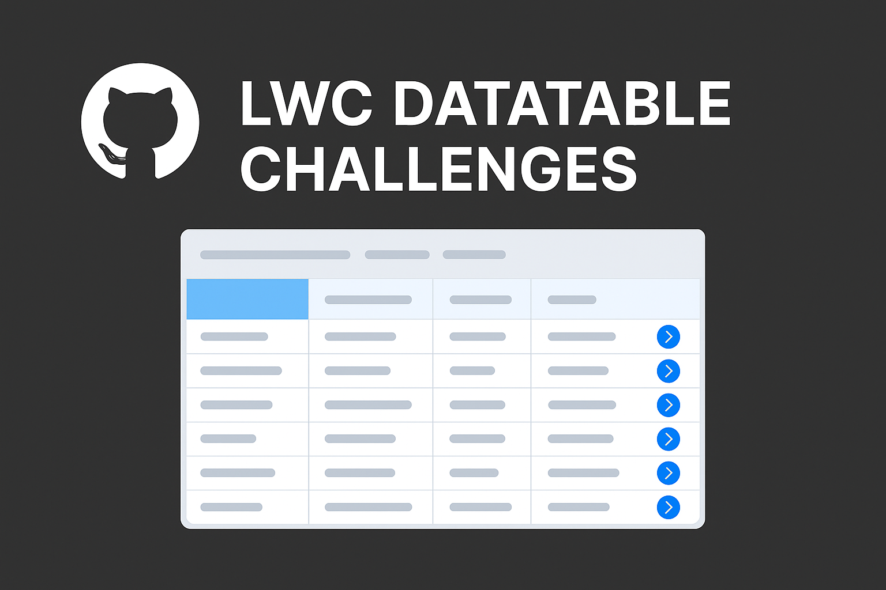

<p align="center">
  
</p>

# ⚡ Lightning Datatable Challenges — LWC Portfolio Series

This repo contains **10 practical, real-world challenges** built with **Lightning Web Components (LWC)** and **Apex**, focused entirely on mastering the `lightning-datatable` component — a critical skill for any Salesforce UI developer.

Each challenge is isolated, documented, and built to help you master datatable functionality ranging from beginner use-cases to advanced real-world implementations.

---

## 🧠 What You’ll Learn

✅ How to:
- Render dynamic and editable datatables  
- Add row actions like edit, delete, view  
- Perform bulk operations with checkboxes  
- Integrate Apex with inline editing  
- Display conditional styling, badges, and icons  
- Sort, paginate, and refresh records  
- Build production-ready, reusable components

---

## 🧪 List of Challenges

| #  | Challenge Title                  | GitHub Link |
|----|----------------------------------|-------------|
| 1  | Basic Table                      | [🔗 Challenge 1](https://github.com/prinson001/lwc-datatable-challenges/force-app/main/default/lwc/datatableChallenge1) |
| 2  | Inline Editing & Save           | [🔗 Challenge 2](https://github.com/prinson001/lwc-datatable-challenges/force-app/main/default/lwc/datatableChallenge2) |
| 3  | Row Actions                      | [🔗 Challenge 3](https://github.com/prinson001/lwc-datatable-challenges/force-app/main/default/lwc/datatableChallenge3) |
| 4  | Bulk Selection & Action         | [🔗 Challenge 4](https://github.com/prinson001/lwc-datatable-challenges/force-app/main/default/lwc/datatableChallenge4) |
| 5  | Conditional Styling             | [🔗 Challenge 5](https://github.com/prinson001/lwc-datatable-challenges/force-app/main/default/lwc/datatableChallenge5) |
| 6  | Parent-Child Display            | [🔗 Challenge 6](https://github.com/prinson001/lwc-datatable-challenges/force-app/main/default/lwc/datatableChallenge6) |
| 7  | Client-side Pagination          | [🔗 Challenge 7](https://github.com/prinson001/lwc-datatable-challenges/force-app/main/default/lwc/datatableChallenge7) |
| 8  | Inline Row Creation             | [🔗 Challenge 8](https://github.com/prinson001/lwc-datatable-challenges/force-app/main/default/lwc/datatableChallenge8) |
| 9  | Sorting Functionality           | [🔗 Challenge 9](https://github.com/prinson001/lwc-datatable-challenges/force-app/main/default/lwc/datatableChallenge9) |
| 10 | Dynamic Columns from Config     | [🔗 Challenge 10](https://github.com/prinson001/lwc-datatable-challenges/force-app/main/default/lwc/datatableChallenge10) |

---

## 🚀 How to Use

1. Clone the repo:
   ```bash
   git clone https://github.com/prinsondsouza/lwc-datatable-challenges.git
